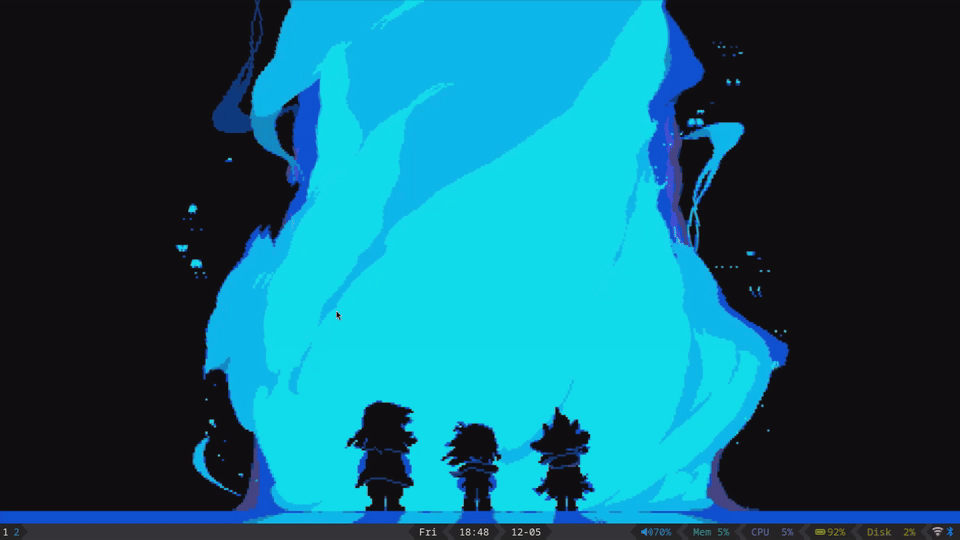

# Power Profile Menu (ppmenu)

Power profile picker for window managers using D-Bus!



## Supported launchers

* [`dmenu`](https://tools.suckless.org/dmenu/)
* [`bemenu`](https://github.com/Cloudef/bemenu)
* [`wmenu`](https://codeberg.org/adnano/wmenu)
* [`rofi`](https://github.com/davatorium/rofi)
* [`tofi`](https://github.com/philj56/tofi)
* [`wofi`](https://github.com/SimplyCEO/wofi)
* [`fuzzel`](https://codeberg.org/dnkl/fuzzel)
* [`walker`](https://github.com/abenz1267/walker)

## Requirements

* `power-profiles-daemon` OR TLP >=1.9.0 (with `tlp-pd` running)
	* Exposes the `org.freedesktop.UPower.PowerProfiles` D-Bus object
* One of the above launchers

## Installation and usage

Download the binary from the [latest release](https://github.com/cobaltgit/ppmenu/releases/latest) for your platform and drop it anywhere!

Usage examples:

* Basic usage:
	```sh
	# start ppmenu using dmenu
	$ ./ppmenu -l dmenu
	```
* Pass additional args to the launcher
	```sh
	# start ppmenu using fuzzel with coloured prompt
	$ ./ppmenu -l fuzzel -a "--prompt-color=0047abff"
	```
